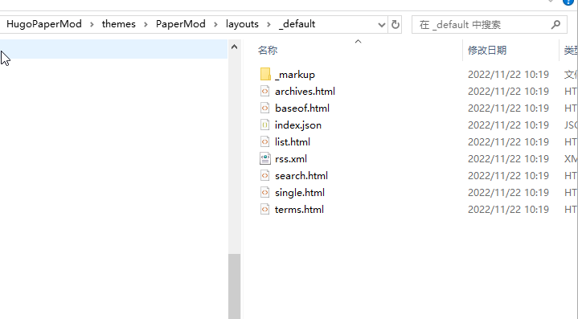
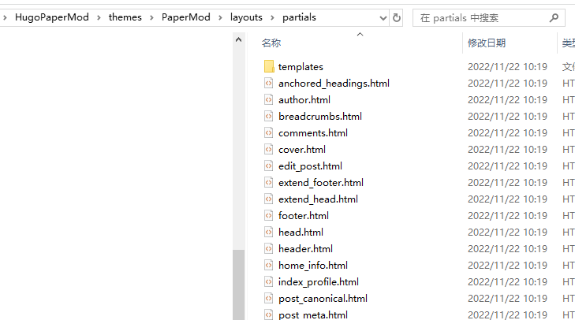

#### QuickStart of PaperMod 

下面的内容来自github上[PaperMod](https://adityatelange.github.io/hugo-PaperMod/)项目Pages

#       Installation | Update    

January 20, 2021 · 3 min · Aditya Telange | [Suggest Changes](https://github.com/adityatelange/hugo-PaperMod/tree/exampleSite/content/posts/papermod/papermod-installation.md)

<details open="">
        <summary accesskey="c" title="(Alt + C)">
            <span class="details">Table of Contents</span>
        </summary>

        <div class="inner"><ul>
                <li>
                    <a href="https://adityatelange.github.io/hugo-PaperMod/posts/papermod/papermod-installation/#intro" aria-label="Intro">Intro</a></li>
                <li>
                    <a href="https://adityatelange.github.io/hugo-PaperMod/posts/papermod/papermod-installation/#guide" aria-label="Guide">Guide</a><ul>
                        
                <li>
                    <a href="https://adityatelange.github.io/hugo-PaperMod/posts/papermod/papermod-installation/#method-1" aria-label="Method 1">Method 1</a></li>
                <li>
                    <a href="https://adityatelange.github.io/hugo-PaperMod/posts/papermod/papermod-installation/#method-2" aria-label="Method 2">Method 2</a></li>
                <li>
                    <a href="https://adityatelange.github.io/hugo-PaperMod/posts/papermod/papermod-installation/#method-3" aria-label="Method 3">Method 3</a></li>
                <li>
                    <a href="https://adityatelange.github.io/hugo-PaperMod/posts/papermod/papermod-installation/#finally-" aria-label="Finally &amp;hellip;">Finally …</a></li>
                <li>
                    <a href="https://adityatelange.github.io/hugo-PaperMod/posts/papermod/papermod-installation/#method-4" aria-label="Method 4">Method 4</a></li></ul>
                </li>
                <li>
                    <a href="https://adityatelange.github.io/hugo-PaperMod/posts/papermod/papermod-installation/#quick-links" aria-label="Quick Links">Quick Links</a><ul>
                        
                <li>
                    <a href="https://adityatelange.github.io/hugo-PaperMod/posts/papermod/papermod-installation/#papermod---featurespapermod-features" aria-label="Papermod - Features"></a><a href="https://adityatelange.github.io/hugo-PaperMod/posts/papermod/papermod-features">Papermod - Features</a></li>
                <li>
                    <a href="https://adityatelange.github.io/hugo-PaperMod/posts/papermod/papermod-installation/#papermod---faqspapermod-how-to" aria-label="Papermod - FAQs"></a><a href="https://adityatelange.github.io/hugo-PaperMod/posts/papermod/papermod-how-to">Papermod - FAQs</a></li>
                <li>
                    <a href="https://adityatelange.github.io/hugo-PaperMod/posts/papermod/papermod-installation/#papermod---variablespapermod-variables" aria-label="Papermod - Variables"></a><a href="https://adityatelange.github.io/hugo-PaperMod/posts/papermod/papermod-variables">Papermod - Variables</a></li>
                <li>
                    <a href="https://adityatelange.github.io/hugo-PaperMod/posts/papermod/papermod-installation/#papermod---iconspapermod-icons" aria-label="Papermod - Icons"></a><a href="https://adityatelange.github.io/hugo-PaperMod/posts/papermod/papermod-icons">Papermod - Icons</a></li>
                <li>
                    <a href="https://adityatelange.github.io/hugo-PaperMod/posts/papermod/papermod-installation/#changeloghttpsgithubcomadityatelangehugo-papermodreleases" aria-label="ChangeLog"></a><a href="https://github.com/adityatelange/hugo-PaperMod/releases">ChangeLog</a></li></ul>
                </li>
                <li>
                    <a href="https://adityatelange.github.io/hugo-PaperMod/posts/papermod/papermod-installation/#sample-configyml" aria-label="Sample config.yml">Sample <code>config.yml</code></a></li>
                <li>
                    <a href="https://adityatelange.github.io/hugo-PaperMod/posts/papermod/papermod-installation/#sample-pagemd" aria-label="Sample Page.md">Sample <code>Page.md</code></a>
                </li>
            </ul>
        </div>
    </details>

## Intro

- **We’ll be using `yml/yaml` format for all examples down below, I recommend using `yml` over `toml` as it is easier to read.**
- You can find any [YML to TOML](https://www.google.com/search?q=yml+to+toml) converters if necessary.

------

## Guide

Follow [Quick Start](https://gohugo.io/getting-started/quick-start/) guide to setup   and create a new site.

> Note: Use -f to select yml format
>
> ```
> hugo new site <name of site> -f yml
> ```

Make sure you install latest version of **`hugo(>=0.83.0)`**.

After you have created a new site, at [Step 3](https://gohugo.io/getting-started/quick-start/#step-3-add-a-theme) follow the steps:

### Method 1

Inside the folder of your Hugo site, run:

```bash
git clone https://github.com/adityatelange/hugo-PaperMod themes/PaperMod --depth=1
```

**Note**: You may use ` --branch v5.0` to end of above command if you want to stick to specific release.

> Updating theme :
>
> ```bash
> cd themes/PaperMod
> git pull
> ```

### Method 2

you can use as [submodule](https://www.atlassian.com/git/tutorials/git-submodule) with

```bash
git submodule add --depth=1 https://github.com/adityatelange/hugo-PaperMod.git themes/PaperMod
git submodule update --init --recursive # needed when you reclone your repo (submodules may not get cloned automatically)
```

**Note**: You may use ` --branch v5.0` to end of above command if you want to stick to specific release.

> Updating theme :
>
> ```bash
> git submodule update --remote --merge
> ```

### Method 3

Or you can Download as Zip from Github Page and extract in your themes directory

Direct Links:

- [Master Branch (Latest)](https://github.com/adityatelange/hugo-PaperMod/archive/master.zip)
- [v6.0](https://github.com/adityatelange/hugo-PaperMod/archive/v6.0.zip)
- [v5.0](https://github.com/adityatelange/hugo-PaperMod/archive/v5.0.zip)
- [v4.0](https://github.com/adityatelange/hugo-PaperMod/archive/v4.0.zip)
- [v3.0](https://github.com/adityatelange/hugo-PaperMod/archive/v3.0.zip)
- [v2.0](https://github.com/adityatelange/hugo-PaperMod/archive/v2.0.zip)
- [v1.0](https://github.com/adityatelange/hugo-PaperMod/archive/v1.0.zip)

### Finally …

Add in `config.yml`:

```yml
theme: "PaperMod"
```

### Method 4

- Install [Go programming language](https://go.dev/doc/install) in your operating system.
- Intialize your own hugo mod

```
hugo mod init YOUR_OWN_GIT_REPOSITORY
```

- Add PaperMod in your `config.yml` file

```
module:
  imports:
  - path: github.com/adityatelange/hugo-PaperMod
```

- Update theme

```
hugo mod get -u
```

------

## Quick Links

- ### [Papermod - Features](https://adityatelange.github.io/hugo-PaperMod/posts/papermod/papermod-features)

- ### [Papermod - FAQs](https://adityatelange.github.io/hugo-PaperMod/posts/papermod/papermod-how-to)

- ### [Papermod - Variables](https://adityatelange.github.io/hugo-PaperMod/posts/papermod/papermod-variables)

- ### [Papermod - Icons](https://adityatelange.github.io/hugo-PaperMod/posts/papermod/papermod-icons)

- ### [ChangeLog](https://github.com/adityatelange/hugo-PaperMod/releases)

------

## Sample `config.yml`

> **Example Site Structure is present here**: [exampleSite](https://github.com/adityatelange/hugo-PaperMod/tree/exampleSite/)

**Use appropriately**

```yml
baseURL: "https://examplesite.com/"
title: ExampleSite
paginate: 5
theme: PaperMod

enableRobotsTXT: true
buildDrafts: false
buildFuture: false
buildExpired: false

googleAnalytics: UA-123-45

minify:
  disableXML: true
  minifyOutput: true

params:
  env: production # to enable google analytics, opengraph, twitter-cards and schema.
  title: ExampleSite
  description: "ExampleSite description"
  keywords: [Blog, Portfolio, PaperMod]
  author: Me
  # author: ["Me", "You"] # multiple authors
  images: ["<link or path of image for opengraph, twitter-cards>"]
  DateFormat: "January 2, 2006"
  defaultTheme: auto # dark, light
  disableThemeToggle: false

  ShowReadingTime: true
  ShowShareButtons: true
  ShowPostNavLinks: true
  ShowBreadCrumbs: true
  ShowCodeCopyButtons: false
  ShowWordCount: true
  ShowRssButtonInSectionTermList: true
  UseHugoToc: true
  disableSpecial1stPost: false
  disableScrollToTop: false
  comments: false
  hidemeta: false
  hideSummary: false
  showtoc: false
  tocopen: false

  assets:
    # disableHLJS: true # to disable highlight.js
    # disableFingerprinting: true
    favicon: "<link / abs url>"
    favicon16x16: "<link / abs url>"
    favicon32x32: "<link / abs url>"
    apple_touch_icon: "<link / abs url>"
    safari_pinned_tab: "<link / abs url>"

  label:
    text: "Home"
    icon: /apple-touch-icon.png
    iconHeight: 35

  # profile-mode
  profileMode:
    enabled: false # needs to be explicitly set
    title: ExampleSite
    subtitle: "This is subtitle"
    imageUrl: ""
    imageWidth: 120
    imageHeight: 120
    imageTitle: my image
    buttons:
      - name: Posts
        url: posts
      - name: Tags
        url: tags

  # home-info mode
  homeInfoParams:
    Title: "Hi there \U0001F44B"
    Content: Welcome to my blog

  socialIcons:
    - name: twitter
      url: "https://twitter.com/"
    - name: stackoverflow
      url: "https://stackoverflow.com"
    - name: github
      url: "https://github.com/"

  analytics:
    google:
      SiteVerificationTag: "XYZabc"
    bing:
      SiteVerificationTag: "XYZabc"
    yandex:
      SiteVerificationTag: "XYZabc"

  cover:
    hidden: true # hide everywhere but not in structured data
    hiddenInList: true # hide on list pages and home
    hiddenInSingle: true # hide on single page

  editPost:
    URL: "https://github.com/<path_to_repo>/content"
    Text: "Suggest Changes" # edit text
    appendFilePath: true # to append file path to Edit link

  # for search
  # https://fusejs.io/api/options.html
  fuseOpts:
    isCaseSensitive: false
    shouldSort: true
    location: 0
    distance: 1000
    threshold: 0.4
    minMatchCharLength: 0
    keys: ["title", "permalink", "summary", "content"]
menu:
  main:
    - identifier: categories
      name: categories
      url: /categories/
      weight: 10
    - identifier: tags
      name: tags
      url: /tags/
      weight: 20
    - identifier: example
      name: example.org
      url: https://example.org
      weight: 30
# Read: https://github.com/adityatelange/hugo-PaperMod/wiki/FAQs#using-hugos-syntax-highlighter-chroma
pygmentsUseClasses: true
markup:
  highlight:
    noClasses: false
    # anchorLineNos: true
    # codeFences: true
    # guessSyntax: true
    # lineNos: true
    # style: monokai
```

------

## Sample `Page.md`

```yml
---
title: "My 1st post"
date: 2020-09-15T11:30:03+00:00
# weight: 1
# aliases: ["/first"]
tags: ["first"]
author: "Me"
# author: ["Me", "You"] # multiple authors
showToc: true
TocOpen: false
draft: false
hidemeta: false
comments: false
description: "Desc Text."
canonicalURL: "https://canonical.url/to/page"
disableHLJS: true # to disable highlightjs
disableShare: false
disableHLJS: false
hideSummary: false
searchHidden: true
ShowReadingTime: true
ShowBreadCrumbs: true
ShowPostNavLinks: true
ShowWordCount: true
ShowRssButtonInSectionTermList: true
UseHugoToc: true
cover:
    image: "<image path/url>" # image path/url
    alt: "<alt text>" # alt text
    caption: "<text>" # display caption under cover
    relative: false # when using page bundles set this to true
    hidden: true # only hide on current single page
editPost:
    URL: "https://github.com/<path_to_repo>/content"
    Text: "Suggest Changes" # edit text
    appendFilePath: true # to append file path to Edit link
---
```

You can use it by creating `archetypes/post.md`

在archetypes/post.md文件里，front matter区域的参数设置作为post类的模板，以后新建post时使用下面这个格式：

```shell
hugo new --kind post <name>
```

比如： `hugo  new  --kind  post  posts/my-first-post.md`

其实还有一个方法，就是把这个作为模板的post.md下的front-matter区域的参数，挑选自己常用的项目，复制在archetypes/default.md同样的位置，以后新建文档直接使用`hugo new  posts/dirname/index.md`,有空可以测试一下。

实际上，这些front  matter定义的数据项和值，都是作为参数，输入给papermod主题的各类html模板文件，最后由hugo编译器将markdown文档中的元素加入到这些html模板文件中，最终生成静态的网页文件。可以打开主题自带的各类模板文件，会发现都是有自定义的语言组织逻辑融合了标准html元素。当然，这是我自己初学这些主题目录下的html文件的猜想。

下面这段代码是themes/PaperMod/layouts/_default/archives.html的代码：

~~~
{{- define "main" }}

<header class="page-header">
  <h1>{{ .Title }}</h1>
  {{- if .Description }}
  <div class="post-description">
    {{ .Description }}
  </div>
  {{- end }}
</header>

{{- $pages := where site.RegularPages "Type" "in" site.Params.mainSections }}

{{- if site.Params.ShowAllPagesInArchive }}
{{- $pages = site.RegularPages }}
{{- end }}

{{- range $pages.GroupByPublishDate "2006" }}
{{- if ne .Key "0001" }}
<div class="archive-year">
  <h2 class="archive-year-header">
    {{- replace .Key "0001" "" }}<sup class="archive-count">&nbsp;&nbsp;{{ len .Pages }}</sup>
  </h2>
  {{- range .Pages.GroupByDate "January" }}
  <div class="archive-month">
    <h3 class="archive-month-header">{{- .Key }}<sup class="archive-count">&nbsp;&nbsp;{{ len .Pages }}</sup></h3>
    <div class="archive-posts">
      {{- range .Pages }}
      {{- if eq .Kind "page" }}
      <div class="archive-entry">
        <h3 class="archive-entry-title">
          {{- .Title | markdownify }}
          {{- if .Draft }}<sup><span class="entry-isdraft">&nbsp;&nbsp;[draft]</span></sup>{{- end }}
        </h3>
        <div class="archive-meta">
          {{- partial "post_meta.html" . -}}
        </div>
        <a class="entry-link" aria-label="post link to {{ .Title | plainify }}" href="{{ .Permalink }}"></a>
      </div>
      {{- end }}
      {{- end }}
    </div>
  </div>
  {{- end }}
</div>
{{- end }}
{{- end }}

{{- end }}{{/* end main */}}

~~~




